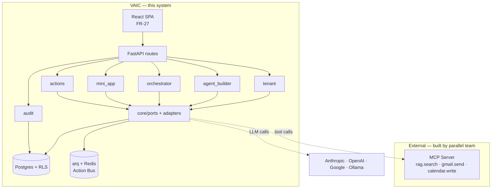
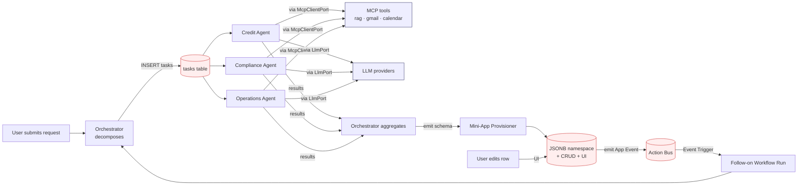

# Architecture Spine — VAIC

## Design Paradigm

**Hexagonal modular monolith.** One FastAPI process composed of bounded modules aligned to the PRD's feature groups. Inside each module, domain logic sits at the center and all I/O (HTTP, DB, LLM providers, MCP tools, sandboxes) flows through ports. Hexagonal because the Model Layer (FR-26), Tools (FR-3), and MCP integration are inherently ports-and-adapters shapes — naming the pattern loads the whole model. Modular monolith because two days, one team, one deploy; the module seams make future microservice extraction trivial if ever needed.

```text
backend/app/modules/
  tenant/          # FR-25, FR-28, identity
  agent_builder/   # FR-1..FR-6
  orchestrator/    # FR-7..FR-11
  mini_app/        # FR-12..FR-17
  actions/         # FR-18..FR-20
  audit/           # FR-21..FR-24
backend/app/core/
  ports/           # LlmPort, ToolPort, AuditPort, McpClientPort, DocIntakePort
  adapters/        # anthropic, openai, google, ollama, mcp_client, sandbox
```

## Invariants & Rules

### AD-1 — Paradigm: Hexagonal Modular Monolith

- **Binds:** all
- **Prevents:** one builder going layered, another microservices, divergence on where domain logic lives
- **Rule:** System is one FastAPI process composed of the six bounded modules in `modules/`. Domain logic lives at each module's center; HTTP routes, DB access, LLM calls, MCP tool invocations, and sandbox execution are ports/adapters and never contain domain decisions. Cross-module calls go through a module's public service interface, never its internal models.

### AD-2 — Multi-tenant isolation at the data layer via Postgres RLS

- **Binds:** FR-25, every persisted write
- **Prevents:** one module filtering `tenant_id` at the API, another at the ORM, another forgetting — cross-tenant leak via a single missed filter
- **Rule:** Every table carries `tenant_id UUID NOT NULL`. Postgres Row-Level Security policies enforce `tenant_id = current_setting('app.tenant_id')` on every row. FastAPI middleware sets the session variable per request from the authenticated user. Application code never filters tenant_id manually. Only the bootstrap script and migrations run with `BYPASSRLS`. [ADOPTED — PRD FR-25 + banking audit obligation make this load-bearing.]

### AD-3 — MCP is the external-tool protocol; Task state is VAIC-internal Postgres

- **Binds:** FR-3, FR-9 (reconciled)
- **Prevents:** coupling VAIC to an MCP server it doesn't own; confusion about where Task state lives
- **Rule:** VAIC is an MCP **client**. Tools owned by the parallel-team MCP server (`rag.search`, `gmail.send`, `calendar.write`, future tools) are invoked through `McpClientPort`. **The MCP server itself is out of scope — VAIC does not build, host, or own it.** Orchestrator-to-Specialist-Agent Task dispatch is an internal domain operation: Task rows live in the `tasks` Postgres table, claimed and completed by the orchestrator's worker loop. The PRD's "MCP doubles as Task Store" is relaxed for MVP. *(Reconciliation: PRD FR-9 and §9 contradict this — see Open Questions.)*

### AD-4 — Single audit sink; append-only at the schema level; failure crashes the Run

- **Binds:** FR-21, all modules
- **Prevents:** one module writing `audit_trail` via raw SQL, another via ORM, another skipping it — broken traces that fail SM-4; silent entry loss when Postgres hiccups
- **Rule:** `audit.log(entry)` in `core/ports/audit.py` is the only path to write `audit_trail`. Every Workflow Run step — Orchestrator decomposition, Task dispatch, Agent retrieval, Tool call, Model invocation (with model name + latency), aggregation, escalation, Mini-App emission — MUST call it. The `audit_trail` table grants `INSERT` only to the app role; `UPDATE` and `DELETE` are revoked. Append-only is enforced at the DB, not just by convention. **If an `audit.log()` call fails (DB down, constraint violation), the calling Workflow Run transitions to `failed` — never silently drop an entry.** This honors PRD counter-metric SM-C1: trace completeness outranks Run completion.

### AD-5 — Visibility Tier enforced at the row level on `mini_app_rows`

- **Binds:** FR-14, FR-15, FR-16
- **Prevents:** API-layer gating that the auto-generated UI or a future bulk-import path bypasses
- **Rule:** RLS policies on `mini_app_rows` encode the access matrix (PRD addendum §A3) using `visibility_tier`, `department_id`, and a whitelist check. The auto-generated CRUD endpoints, the React UI, and any future path inherit the same gating because they all read rows through SQL. No client-side or API-only gating.

### AD-6 — Persisted state machines with compare-and-set on every transition

- **Binds:** FR-7, FR-8, FR-9, FR-10
- **Prevents:** in-memory run state lost on process restart; two Specialist Agents racing on the same Task; inconsistent resume and timeout semantics across builders
- **Rule:** Every stateful record (`workflow_runs`, `tasks`, `mini_app_rows`) carries a `status` (or `version`) enum. State transitions are a single `UPDATE ... WHERE id=? AND status=?` **and the application checks `rowcount == 1`** — a zero-row update means another worker won the race and the local attempt aborts cleanly. Specific machines:
  - `workflow_runs.status`: `pending | running | awaiting_human | completed | failed | timed_out`. arq workers poll `pending` on startup and resume. Escalations flip `running → awaiting_human`; the 5-min timeout flips `awaiting_human → timed_out`.
  - `tasks.status`: `pending | claimed | completed | failed`. A Specialist Agent worker claims via `UPDATE ... WHERE status='pending'`; if `rowcount == 0`, another Agent beat it — abandon and pick the next.
  - `mini_app_rows`: see AD-8 — writes carry an optimistic `version` column bumped on every UPDATE; a stale-version write is rejected.

### AD-7 — Model Layer is a port; Agent picks provider+model at config time

- **Binds:** FR-5, FR-26
- **Prevents:** Agent code importing the Anthropic SDK directly while Orchestrator imports OpenAI; provider lock-in against the user's explicit "model is user-configurable" requirement
- **Rule:** `LlmPort` (`complete`, `stream`, `embed`) in `core/ports/llm.py` is the only abstraction agents and the orchestrator may import. Adapters: `anthropic`, `openai`, `google`, `ollama`. The Agent record stores `{provider, model_name, parameters}` as data — never as code. **The platform never fixes the model; it always reads from Agent config.** A missing provider surfaces at run time, logged in `audit_trail`.

### AD-8 — Mini-App schema emission is the only Agent→Provisioner contract; mini_app ownership is single

- **Binds:** FR-12, FR-13, FR-14, FR-15, FR-17
- **Prevents:** Agent emitting ad-hoc shapes; Provisioner growing module-specific branches; ambiguous ownership of `mini_app_rows` between the auto-gen CRUD endpoints and Agent-initiated writes
- **Rule:** Mini-App emission is a JSON document validated against the schema-meta-schema before persistence. The Provisioner is a function `(tenant_id, department_id, owner_id, valid_schema, initial_rows?) -> (namespace + CRUD endpoints + UI)`. It creates the namespace AND the initial row(s) **atomically in one DB transaction** (the PRD §A6 example — "one row carrying the consolidated decision" — flows through this path). After provisioning, **the `mini_app` module's auto-generated CRUD endpoints are the sole writers to `mini_app_rows`.** Specialist Agents never write to `mini_app_rows` directly post-provisioning; if a Run needs to update a row, it routes through the same CRUD endpoints. App Event emission (AD-9) fires from those endpoints, not from Agent code.

### AD-9 — App Events flow only through the Action Bus

- **Binds:** FR-17, FR-19, FR-20
- **Prevents:** Mini-App writing directly to a Workflow Run; bypass of sequence numbering and at-least-once guarantees
- **Rule:** Mini-App row changes (create / update / delete) emit App Events onto the Action Bus (an arq queue). Event Triggers subscribe via filter expressions. Workflow Runs start only via: (a) explicit user action, (b) Schedule Trigger, or (c) Event Trigger match. No direct Mini-App → Workflow Run call paths.

### AD-10 — Tenant context is materialized in job payloads and re-set at worker entry

- **Binds:** all background work — FR-9 (Workflow Run execution), FR-18 (Schedule Triggers), FR-19 (Event Triggers)
- **Prevents:** the classic Python async footgun where a `contextvars.ContextVar` set by FastAPI middleware dies at the arq worker process boundary — every background Run would crash on RLS or leak across tenants
- **Rule:** `tenant_context` is set by FastAPI middleware on HTTP paths (Convention). For every background job enqueued (Workflow Run, Event Trigger fan-out, Schedule Trigger fan-out), the enqueuer MUST capture `tenant_id` (and `department_id` if relevant) from the current context and serialize it into the arq job kwargs. The arq worker function's first action is to deserialize those fields, set the `contextvars.ContextVar`, and issue `SET LOCAL app.tenant_id` on its DB connection before any domain work. **Schedule Triggers fire without HTTP context**: the arq `cron_jobs` entrypoint runs a single job that (i) enumerates all tenants with matching schedules (under `BYPASSRLS`), (ii) for each tenant enqueues a per-tenant Run job with that tenant's `tenant_id` materialized in the payload. Never assume a worker inherits context from anywhere.

### AD-11 — Client-side department scope on every MCP call

- **Binds:** FR-2 (reconciled), FR-3, FR-6
- **Prevents:** AD-2's RLS cannot reach the parallel-team MCP server — without an explicit rule, a Credit Agent's `rag.search` could retrieve HR-department documents, silently breaking the PRD's department-isolation guarantee
- **Rule:** Every `McpClientPort` call MUST include `tenant_id` and `department_id` as parameters (or a derived `namespace_token` the parallel team agrees to honor). VAIC's `McpClientPort` implementation **enforces client-side** that the parameters match the calling Agent's `department_id`; a mismatched call raises before it hits the network. The MCP server is trusted to honor the scope; if it doesn't, that's the parallel team's defect, but VAIC never sends an unscoped call. This is the only mechanism standing behind PRD FR-2's department-isolation consequence while retrieval is outsourced.

## Dependency direction



The dependency arrows point **inward to ports, outward to adapters**. Modules never depend on each other's internals; they call through `core/ports/`. The MCP server and LLM providers are leaves — adapters only, never imported by domain code.

## Closed loop — the load-bearing flow



This is what makes VAIC architecturally novel — agent generates app → app emits events → agents react. Every arrow in this diagram is governed by an AD: Orchestrator→tasks (AD-6), Agent→MCP tools (AD-3), Agent→LLM (AD-7), Aggregation→Provisioner (AD-8), Mini-App→Bus (AD-9).

## Consistency Conventions

| Concern | Convention |
| --- | --- |
| Entity IDs | UUID v7 (time-ordered, indexable). Never autoincrement. |
| Timestamps | UTC, ISO 8601 with milliseconds (`2026-07-17T08:34:12.123Z`). Column type `timestamptz`. |
| Tenant context | `contextvars.ContextVar` set by FastAPI middleware after auth on HTTP paths. **For arq background jobs, the worker re-sets the contextvar from materialized `tenant_id` in the job payload** (AD-10). Domain code reads `tenant_context.get()`; never pass `tenant_id` as a function argument. DB layer sets the RLS session variable from the same var. |
| Error shape | `{error: {code: string, message: string, details: object, trace_id: uuid}}` — every API error, no exceptions. |
| API envelope | `{data, error, meta}` per project rules. `meta` carries pagination. |
| Event naming | `domain.event_type` — e.g., `mini_app.row.created`, `workflow.run.completed`, `action.trigger.fired`. |
| Audit entry | `{run_id, step_id, agent_id, ts, type, input, output, latency_ms, model}` — exact field names from PRD §FR-21. |
| File naming | Python `snake_case`; routes `kebab-case`; React components `PascalCase`; CSS `kebab-case`. |
| Function size | **Hard ceiling: 50 lines.** Split before merge if longer. applies to both backend and frontend. |
| Async jobs | arq only — both Schedule Triggers (via `cron_jobs`) and background Workflow Run execution. No Celery, no APScheduler, no background threads for domain work. |
| Embedded Python Tools | Only when a Tool can't be expressed as an MCP tool. Executes in a subprocess: no network, restricted builtins, 10s CPU cap, 128 MB memory. Caller passes input via stdin, reads stdout. [ASSUMPTION — MVP downgrade; production needs WASM via `wasmtime-py` or E2B.] |
| MCP calls | Every `McpClientPort` call carries `tenant_id` + `department_id` matching the calling Agent; client-side raise on mismatch (AD-11). Never send an unscoped MCP call. |
| Background jobs | Tenant context is materialized in job kwargs at enqueue time; the worker re-sets contextvar + DB session var at entry (AD-10). Schedule Triggers fan out per-tenant from a single `cron_jobs` entrypoint. |
| Definition of Done | A feature is not done until (a) tests pass with evidence (test `file:line` + green run output) and (b) code reference (production `file:line`) are visible in the PR. |
| No premature abstraction | Rule of Three before extracting a shared helper or introducing a port. Two call sites is not a pattern. |
| Error handling | Errors propagate via exceptions in domain code; the API boundary translates to the error envelope. Never swallow. Never return `None` to mean error. |

## Stack

Web-verified 2026-07-17. Pin these in `pyproject.toml` and `package.json`; the code owns upgrades once it exists.

| Name | Version | Role |
| --- | --- | --- |
| Python | 3.13 | Backend language (3.12 is security-only; 3.13 is the 2026 boring choice) |
| FastAPI | 0.139.x | HTTP API |
| SQLAlchemy | 2.x | ORM (sync; async adds complexity not needed for MVP) |
| Pydantic | 2.x | Validation, schemas |
| Alembic | latest | Migrations |
| PostgreSQL | 18 | Primary DB, RLS (RLS behavior identical to 16; 18 is current stable) |
| pgvector | 0.7+ | Only if FR-2 reconciliation yields VAIC-side retrieval; skip otherwise |
| Redis | 7.4+ | arq broker only (7.2 reached EOL 2026-02-28) |
| arq | 0.26+ | Async jobs + cron |
| `mcp` (Python SDK) | v1.x | MCP client (v2.0.0 due 2026-07-28 — stick to v1) |
| `anthropic` | 0.114.0 | Claude adapter |
| `openai` | latest | OpenAI adapter |
| `google-genai` | latest | Gemini adapter (optional — only if team brings Google keys) |
| React | 19 | SPA |
| Vite | 8 | Bundler/dev server |
| TypeScript | 7.x | Type safety |
| Tailwind CSS | 4 | Styling |
| TanStack Query | latest | Server state (SPA convention) |
| Vitest | latest | Unit tests |
| Playwright | latest | E2E for UJ-1 and UJ-2 |

## Structural Seed

```text
vaic/
  backend/
    app/
      main.py                    # FastAPI app, middleware, route registration
      modules/
        tenant/                  # FR-25, FR-28, identity
          routes.py
          service.py
          models.py
        agent_builder/           # FR-1..FR-6
          routes.py
          service.py
          models.py
        orchestrator/            # FR-7..FR-11
          routes.py
          service.py             # decomposition, dispatch, aggregate
          models.py              # workflows, workflow_runs, tasks
        mini_app/                # FR-12..FR-17
          routes.py              # auto-gen CRUD endpoints (mounted per app)
          provisioner.py         # the pure function (AD-8)
          models.py
          ui_renderer.py         # emits React route from UI spec
        actions/                 # FR-18..FR-20
          routes.py
          bus.py                 # arq-backed Action Bus
          triggers.py            # Schedule + Event triggers
        audit/                   # FR-21..FR-24
          routes.py              # trace dashboard API, export
          sink.py                # the only writer (AD-4)
      core/
        ports/
          llm.py                 # LlmPort
          tool.py                # ToolPort (MCP + embedded-Python unified)
          audit.py               # audit.log() entry point
          mcp_client.py          # McpClientPort
          doc_intake.py          # document upload → parallel-team MCP server
        adapters/
          anthropic.py
          openai.py
          google.py
          ollama.py
          mcp_client.py
          sandbox.py             # subprocess runner for embedded Python
        tenant_context.py        # contextvars + middleware
        errors.py                # error envelope
      bootstrap/
        seed_demo_tenant.py      # FR-28 + addendum §A8
    scripts/
      bootstrap_demo_tenant.py
    tests/
      unit/
      integration/
      e2e/
    pyproject.toml
    alembic.ini
  frontend/
    src/
      routes/                    # file-based routing (TanStack Router or React Router)
        agent-builder/
        orchestrator/
        mini-apps.$appId/        # dynamic Mini-App UIs (FR-15)
        trace.$runId/            # Trace Dashboard (FR-22, FR-23)
        actions/
      components/
      hooks/
      lib/
    vite.config.ts
    package.json
  infra/
    docker-compose.yml           # postgres, redis
  docs/
```

## Capability → Architecture Map

| Capability / Area | Lives in | Governed by |
| --- | --- | --- |
| FR-1 Create Agent | `agent_builder/service.py` | AD-1, AD-2 |
| FR-2 Per-Agent KB (intake half) | `agent_builder/service.py` + `core/ports/doc_intake.py` | AD-2, AD-11; FR-2 split pending reconciliation |
| FR-3 Per-Agent Tool config | `agent_builder/service.py` + `core/ports/tool.py` | AD-1, AD-3, AD-11 |
| FR-4 API Integration | `agent_builder/service.py` | AD-3; **likely collapses** — Gmail/Calendar are MCP tools |
| FR-5 Per-Agent Model selection | `agent_builder/service.py` + `core/ports/llm.py` | AD-7 |
| FR-6 Ownership & Department scoping | `agent_builder/service.py` + RLS + `McpClientPort` scope check | AD-2, AD-11 |
| FR-7 Workflow definition | `orchestrator/service.py` | AD-6 |
| FR-8 Dynamic decomposition | `orchestrator/service.py` (LLM-driven planner prompt) | AD-6, AD-7 |
| FR-9 Task dispatch & aggregation | `orchestrator/service.py` (arq worker path) | AD-3, AD-6, AD-10 |
| FR-10 Human escalation | `orchestrator/service.py` | AD-6 |
| FR-11 Per-step feedback | `orchestrator/service.py` + `audit/sink.py` | AD-4, AD-6 |
| FR-12 Schema + UI spec emission | `orchestrator/service.py` | AD-8 |
| FR-13 JSONB namespace provisioning | `mini_app/provisioner.py` | AD-5, AD-8 |
| FR-14 CRUD endpoints | `mini_app/routes.py` | AD-5, AD-8 |
| FR-15 Auth-gated UI | `frontend/routes/mini-apps.$appId/` + `mini_app/ui_renderer.py` | AD-5 |
| FR-16 Visibility Tier enforcement | RLS on `mini_app_rows` | AD-5 |
| FR-17 App Event emission | `mini_app/routes.py` → `actions/bus.py` | AD-8, AD-9 |
| FR-18 Schedule Trigger | `actions/triggers.py` (arq `cron_jobs`, per-tenant fan-out) | AD-9, AD-10 |
| FR-19 Event Trigger | `actions/triggers.py` (worker re-sets tenant context from payload) | AD-9, AD-10 |
| FR-20 Action Bus reliability | `actions/bus.py` (arq at-least-once) | AD-9 |
| FR-21 Audit Trail logging | `audit/sink.py` | AD-4 |
| FR-22 Trace timeline | `audit/routes.py` + `frontend/routes/trace.$runId/` | AD-4 |
| FR-23 Trace collaboration graph | `audit/routes.py` + frontend | AD-4 |
| FR-24 Audit export | `audit/routes.py` | AD-4 |
| FR-25 Multi-Tenant isolation | RLS on every table | AD-2 |
| FR-26 Model Layer | `core/ports/llm.py` + `core/adapters/*` | AD-7 |
| FR-27 React SPA | `frontend/` | AD-1 |
| FR-28 Tenant bootstrap | `bootstrap/seed_demo_tenant.py` | AD-2 |

## Deferred

Decisions and dimensions this altitude intentionally does **not** fix — each can wait for the reason given. Anything smelling like future-proofing landed here rather than as an AD.

- **Per-Model token spend counter UI** (PRD §8.2) — log the data in `audit_trail` now; surface in the Trace Dashboard only if a demo rehearsal shows the rubric wants it.
- **Streaming partial Agent responses** — PRD §5 non-goal; arq workers complete then surface.
- **Visual drag-drop Workflow editor** — PRD §5 non-goal.
- **Exactly-once App Event delivery** — PRD §5 non-goal; at-least-once with sequence numbers is the contract.
- **Stronger embedded-Python sandbox** — wasmtime-py / E2B replaces subprocess approach when a Tool actually needs it.
- **Per-tenant encryption at rest** — post-hackathon.
- **Multi-region deployment** — single-region for MVP.
- **Cross-Tenant Mini-App marketplace** — PRD §5 non-goal.
- **Webhook ingress for Event Triggers** — only internal App Events fire Workflows for MVP.
- **Audit Trail archival** — keep last 7 days for demo (PRD §6.2 assumption).
- **pgvector / VAIC-side retrieval** — pending FR-2 reconciliation. If the parallel-team MCP server owns all retrieval, VAIC has no vector store.
- **Per-module extraction to microservices** — seams preserved by AD-1; not needed for hackathon.
- **Full RBAC engine** — builder + manager + operator only for v1 (PRD assumption).
- **Vietnamese-language UI depth** — labels only for MVP (PRD assumption).
- **Agent fine-tuning / training** — out of v1.
- **C4 diagram set / solution-design prose** — only if a mentor review asks for it.

## Open Questions (Architecture-owned)

These were deferred from the PRD or surfaced by this run. Each has a revisit condition in the memlog.

1. **FR-2 reconciliation.** PRD FR-2 says "The platform chunks, embeds, indexes, and serves retrieval." User correction: `rag.search` is an MCP tool owned by the parallel team. **Does VAIC upload documents to the MCP server via an admin tool, or does VAIC hold its own document store and pass a department-scoped namespace ID to `rag.search`?** Affects whether `pgvector` is in the stack at all. *Revisit: before Agent Builder epics start.*
2. **FR-4 reconciliation.** With Gmail and Calendar as MCP tools, does FR-4 (API Integration as a distinct concept) survive, or do all "integrations" become MCP tool registrations? Recommend collapsing FR-4 into FR-3 for MVP. *Revisit: when scoping Agent Builder stories.*
3. **MCP server contract.** What's the exact tool list, input/output schemas, and auth model the parallel team exposes? Architecture needs the MCP server's tool catalog as a contract before Agent Builder epics start. *Revisit: as soon as the parallel team publishes a tool list.*
4. **MCP server outage behavior.** AD-3 says "VAIC must survive" — but what does the Workflow Run do when an MCP tool call fails? Retry budget, fallback, or fail the Run? *Revisit: when designing FR-9 error paths.*
5. **Department isolation on MCP side.** If the MCP server owns retrieval (FR-2), how does it enforce that a Credit Agent's `rag.search` call can't see an HR department's documents? VAIC's RLS doesn't reach into the MCP server. *Revisit: with the parallel team — likely a namespace parameter on `rag.search`.*
6. **Audit Trail signing key.** PRD assumption defers to Architecture. Recommendation: HMAC with a per-tenant key stored in `tenants.audit_key_id` → `audit_keys` table; signature in `audit_trail.signature`. Minimal crypto, sufficient for demo. *Revisit: when implementing FR-24 export.*

## PRD Reconciliation Items

The spine surfaced contradictions between the user's mid-run corrections and the finalized PRD. These are flagged for a follow-up `bmad-edit-prd` run, **not** blockers for the build:

- **PRD §9** claims "the platform ships with an MCP server component exposing the Task Store and Tool invocation surface." Reality: VAIC is an MCP client; the parallel team ships the server. **Suggest: rewrite §9 to reflect VAIC as MCP client.**
- **PRD FR-2** claims VAIC chunks/embeds/indexes/serves. Reality (per user): the parallel team owns `rag.search`. **Suggest: split FR-2 into FR-2a (intake + department tagging — VAIC) and FR-2b (retrieval — MCP server).**
- **PRD FR-4** (API Integration as VAIC-side stubbed endpoints). Reality (per user): Gmail/Calendar are MCP tools. **Suggest: collapse FR-4 into FR-3 or mark as non-goal for MVP.**
- **PRD FR-9** "MCP also serves as the shared Task Store." Reality: VAIC's Task state is Postgres-internal. **Suggest: rewrite FR-9 to reflect MCP as tool-protocol only.**

These don't block implementation — the spine is the build contract. They block the *next* PRD finalization pass.
