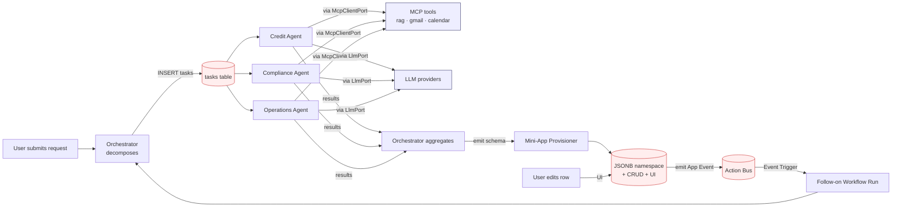

# Closed loop — the load-bearing flow

This is what makes VAIC architecturally novel — agent generates app → app emits events → agents react. Every arrow in this diagram is governed by an AD: Orchestrator→tasks (AD-6), Agent→MCP tools (AD-3), Agent→LLM (AD-7), Aggregation→Provisioner (AD-8), Mini-App→Bus (AD-9).
