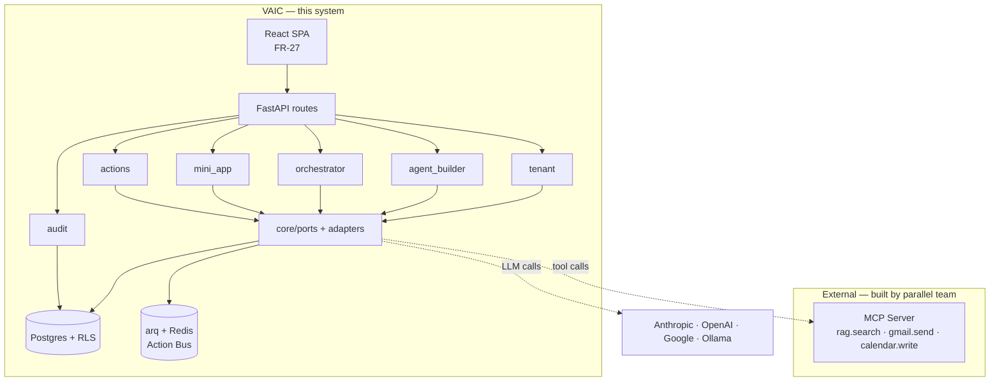

# Dependency direction

The dependency arrows point **inward to ports, outward to adapters**. Modules never depend on each other's internals; they call through `core/ports/`. The MCP server and LLM providers are leaves — adapters only, never imported by domain code.
